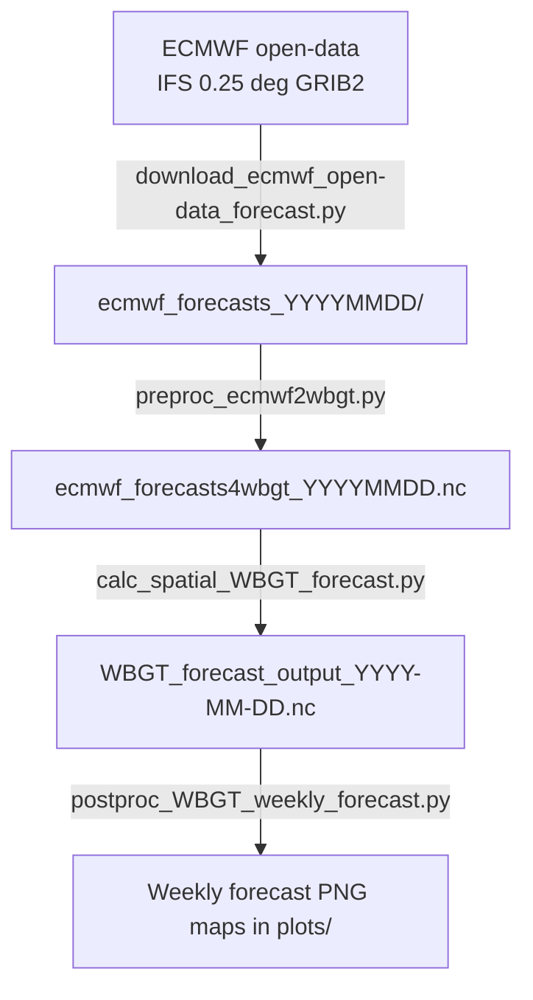
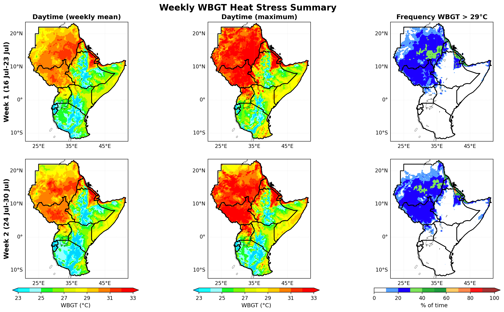
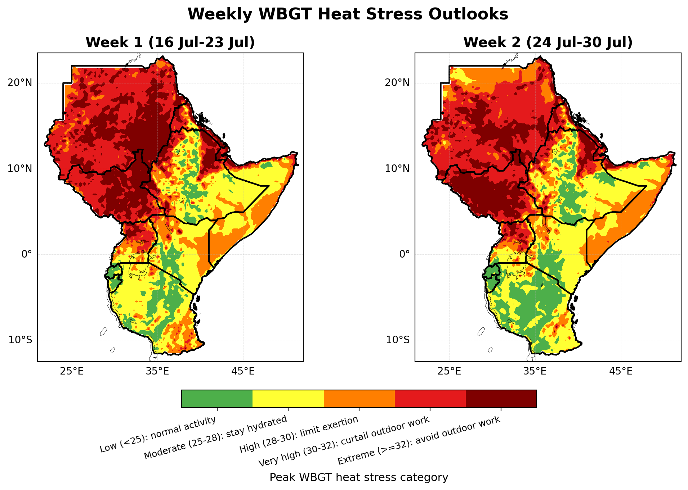
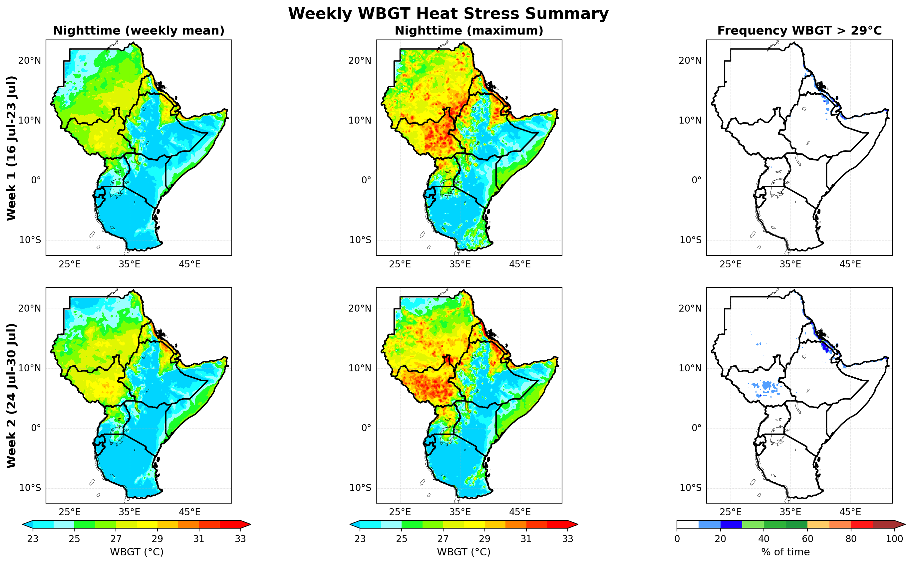
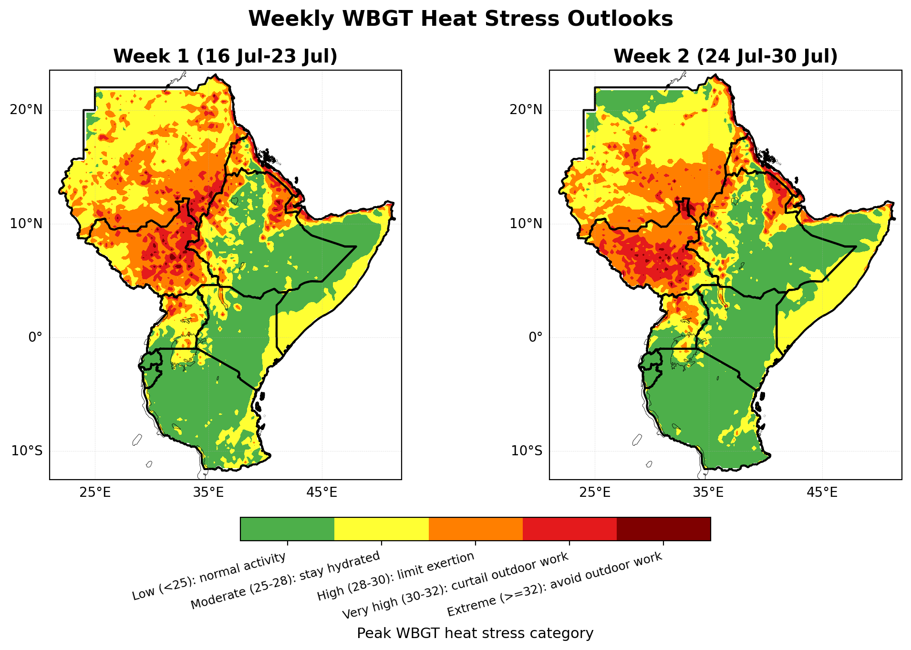

# Heat-Stress Forecast Tools

First release of a heat-stress forecasting tool for the Greater Horn of Africa,
developed and tested using ECMWF open-data medium-range forecasts under the PASSAGE
Project at ICPAC.

The heat stress forecasting tool has been rigorously tested using 80 years of
historical ERA5 reanalysis data to evaluate its performance across a wide range
of climate conditions and extreme heat events. This extensive historical assessment
has helped verify the robustness of the methodology, ensure the reliability of the
forecast products, and build confidence in its application for operational heat stress
monitoring and early warning over the Greater Horn of Africa.

The pipeline downloads ECMWF IFS open-data forecasts, derives the meteorological
inputs required by the forecasting system, computes gridded **daytime and nighttime WBGT**
with the Liljegren et al. (2008) method, and produces weekly heat-stress summary
and operational category maps.

> Maintained by the IGAD Climate Prediction and Applications Centre (**ICPAC**).

---

## Contents

| File | Role |
|------|------|
| `download_ecmwf_open-data_forecast.py` | Download ECMWF open-data surface GRIB2 fields per forecast step |
| `preproc_ecmwf2wbgt.py` | Build the continuous 6-hourly WBGT input fields (day/night: T, RH, wind, pressure, radiation) |
| `calc_spatial_WBGT_forecast.py` | Compute gridded daytime/nighttime WBGT (driver script) |
| `wbgt_functions.py` | WBGT library for solver |
| `postproc_WBGT_weekly_forecast.py` | Weekly summary maps + operational heat-stress category maps |
| `environment.yml` | Reproducible conda environment (`heat-stress`) |

---

## How it works



**Forecast design.** ECMWF open data are published at 3-hourly steps out to 144 h
and 6-hourly steps from 150–360 h. The pre-processor combines these into a
**continuous 6-hourly series (0-360 h)**, pairing the interval maximum/minimum
2 m temperatures with matching humidity so that WBGT can be computed separately
for the **hot (daytime)** and **cool (nighttime)** part of each 6-hour window.

---

## Installation

Requires [conda](https://docs.conda.io/) (Miniconda/Miniforge). All versions are
pinned in `environment.yml` for reproducibility.

```bash
# create the environment
conda env create -f environment.yml

# activate it
conda activate heat-stress
```

For headless / server runs (saving figures without a display):

```bash
export MPLBACKEND=Agg
```

**Admin boundary shapefiles** are required by the post-processing step (to mask
and clip maps to the region of interest). They are not bundled here. Point the
`ADMIN0` / `ADMIN1` paths in `postproc_WBGT_weekly_forecast.py` at your own
shapefiles (default: `/data/shapefiles/gha/gha_admin0.shp` and `..._admin1.shp`).

---

### Clone the repository using Git

If you have Git installed, clone the repository with:

```bash
git clone https://github.com/tamiratB/heat-stress-forecast-tool.git
```

Then navigate to the project directory:

```bash
cd heat-stress-forecast-tool
```

### Download the repository as a ZIP file

If you prefer not to use Git, you can download the latest version of the repository as a ZIP archive:

```text
https://github.com/tamiratB/heat-stress-forecast-tool/archive/refs/heads/main.zip
```

Alternatively, on the GitHub repository page, click **Code** then click **Download ZIP** to download the latest source code.

---

## Usage

Run the four stages in order. Each stage stamps its output with the current date,
so a same-day run chains automatically.

### 1. Download ECMWF open-data forecasts

To download ECMWF forecast data used by this tool, users should register for a free ECMWF account and configure their API credentials as described in the ECMWF API documentation following the link https://github.com/ecmwf/ecmwf-api-client. The client is installed automatically during the installation process. You only need to configure the API keys.

```bash
python download_ecmwf_open-data_forecast.py
```
Downloads the **00 UTC** run to `./ecmwf_forecasts_YYYYMMDD/` as per-step GRIB2
files (`2d, 10u, 10v, sp, ssrd` at all steps; `mx2t3/mn2t3` at 3-hourly steps,
`mx2t6/mn2t6` at 6-hourly steps). Re-running skips files already present and
retries transient network failures. *Requires an internet connection.*

### 2. Build the WBGT input fields
```bash
python preproc_ecmwf2wbgt.py
```
Reads the GRIB2 files and writes `ecmwf_forecasts4wbgt_YYYYMMDD.nc` a 6-hourly
dataset of `t2max, t2min, d2m, rh_tmax, rh_tmin, U, sp, ssrd` (times in UTC).

### 3. Compute WBGT
```bash
python calc_spatial_WBGT_forecast.py
```
Runs the main solver twice (warm and cool extreme) and writes
`forecasts/WBGT_forecast_output_YYYY-MM-DD.nc` with:
`WBGT_tmax`, `WBGT_tmin` (daytime / nighttime WBGT, °C) and the components
`Tw_tmax, Tg_tmax, Tw_tmin, Tg_tmin`.

### 4. Weekly post-processing & maps
```bash
python postproc_WBGT_weekly_forecast.py
```
Produces, for **Week 1** and **Week 2** of the forecast, into `plots/`:
- **Summary** (`plots/*_weekly_forecast_summary_*.png`) average of the daily maxima,
  weekly maximum WBGT, and frequency of WBGT above a threshold.
- **Category** (`plots/*_weekly_forecast_categories_*.png`) the weekly peak WBGT
  classified into operational heat-stress bands with work/rest guidance.

Key settings at the top of the script: `VAR` (`WBGT_tmax` daytime or `WBGT_tmin`
nighttime), `THRESHOLD` (exceedance level, °C), `EXTENT` domain of interest, and the `ADMIN0/ADMIN1`
shapefiles. Weeks are derived automatically from the run date.

---

## Example output

Weekly heat-stress maps produced by `postproc_WBGT_weekly_forecast.py`
(Greater Horn of Africa, sample run). Each **summary** figure shows, per forecast
week, the average of the daily maxima, the weekly maximum WBGT, and the frequency
of threshold exceedance; each **category** figure classifies the weekly peak WBGT
into operational heat-stress bands with work/rest guidance.

**Daytime Stress**




**Nighttime Stress**




## Scientific method & citation

WBGT is computed with the physically based model of:

> Liljegren, J. C., Carhart, R. A., Lawday, P., Tschopp, S., & Sharp, R. (2008).
> *Modeling the Wet Bulb Globe Temperature Using Standard Meteorological
> Measurements.* Journal of Occupational and Environmental Hygiene, 5(10),
> 645–655. https://doi.org/10.1080/15459620802310770

Outdoor WBGT = 0.7·Tw + 0.2·Tg + 0.1·Ta, where Tw is the natural wet-bulb
temperature and Tg the black-globe temperature.

---

## Data source and attribution (ECMWF open data)

This software uses forecast data from the **ECMWF open dataset (real-time
forecasts)**, produced by the European Centre for Medium-Range Weather Forecasts
(ECMWF) with the Integrated Forecasting System (IFS).

- **Source:** ECMWF https://www.ecmwf.int/en/forecasts/datasets/open-data
- **Licence:** Creative Commons Attribution 4.0 International (**CC BY 4.0**)
https://creativecommons.org/licenses/by/4.0/

In accordance with the CC BY 4.0 terms, when you redistribute this data or any
product derived from it (including the maps produced here) you must:

1. **Give appropriate credit** to ECMWF as the source of the original data.
2. **Provide a link to the licence** (CC BY 4.0).
3. **Indicate if changes were made** the products in this repository are
   *derived* from ECMWF open data (temporal recombination, unit conversion, and
   computation of WBGT and derived statistics).

Suggested attribution statement:

> Contains modified ECMWF open data (real-time forecasts), © ECMWF, licensed
> under CC BY 4.0. WBGT products derived by ICPAC.

**Disclaimer (ECMWF).** ECMWF does not accept any liability whatsoever for any
error or omission in the data, their availability, or for any loss or damage
arising from their use. ECMWF does not endorse this application or its outputs.

---

## License

This software is released under a **custom license based on the MIT License**,
with a **mandatory attribution requirement** and a disclaimer of responsibility,
see the [`LICENSE`](LICENSE) file for the full text. You are free to use, copy,
modify, and distribute it, provided the conditions below are met.

> Note: the license covers **this software only**. The ECMWF forecast data it
> consumes is licensed separately under CC BY 4.0 (see *Data source and
> attribution* above).

### Mandatory acknowledgement of ICPAC

Any **use, adaptation, or distribution** of this heat-stress forecast system - in
whole or in part, including any forecast products, maps, or other outputs it
generates **must** give clear and visible acknowledgement to the **IGAD Climate
Prediction and Applications Centre (ICPAC)** as its originator. A statement
substantially in the following form satisfies this requirement:

> Heat-stress forecast system developed by the IGAD Climate Prediction and
> Applications Centre (ICPAC).

### Use at your own responsibility

The software and any forecasts, maps, or other outputs it produces are provided
**"as is"** and are used **entirely at the user's own risk and responsibility**.
ICPAC makes no warranty as to the accuracy, reliability, or fitness of the
software or its outputs for any purpose and **accepts no responsibility or
liability** for any loss or damage arising from their use.

## Acknowledgements

- **ICPAC** IGAD Climate Prediction and Applications Centre for developing and
  maintaining the heat-stress forecast system.
- **CLARE** This work was carried out with financial support from the UK Government's Foreign, Commonwealth & Development Office and the International Development Research Centre, Ottawa, Canada as part of the Climate Adaptation and Resilience Program (CLARE).
- **PASSAGE** This output is part of the PASSAGE Project, funded as part of CLARE.
- **ECMWF** for providing open-access real-time forecast data.

## Contact


